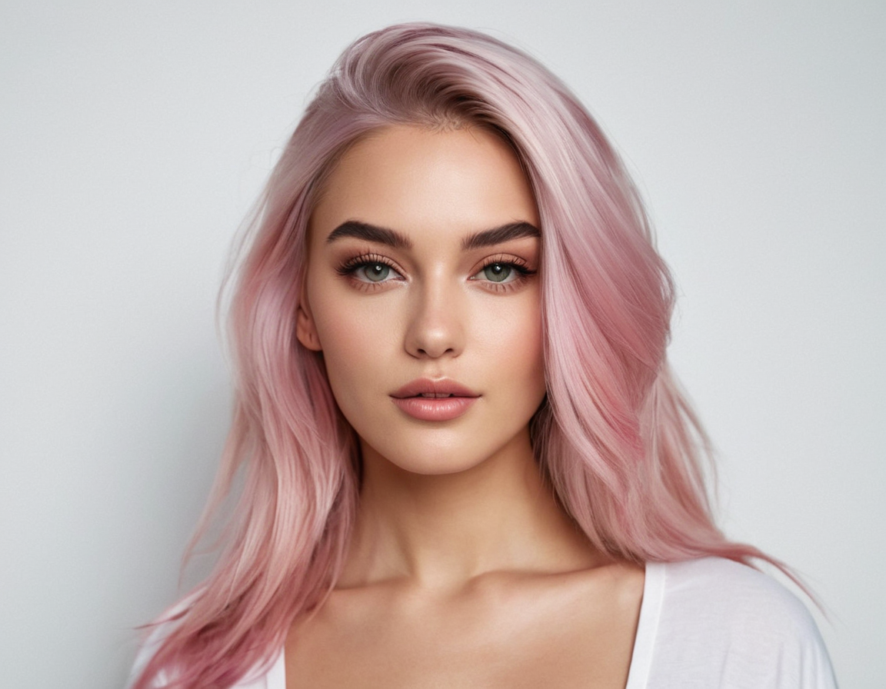

# Thatcher Effect Implementation

This project implements the Thatcher Effect, a psychological phenomenon where it becomes difficult to detect local feature changes in an upside-down face, despite identical changes being obvious in an upright face.

## What is the Thatcher Effect?

The Thatcher Effect, also known as the Thatcher Illusion, is named after British Prime Minister Margaret Thatcher, whose image was used in the original study. In this effect:

1. A face is modified by inverting its eyes and mouth.
2. The entire face is then turned upside down.

When viewed upside down, the face might appear relatively normal. However, when the image is rotated to its upright position, the distortions become strikingly apparent.

When viewed upside down, the face might appear relatively normal. 

<div style="display: flex; flex-direction: row;">
  
  
</div>

However, when the image is rotated to its upright position, the distortions become strikingly apparent.

<div style="display: flex; flex-direction: row;">
  
  
</div>


## How Implementation Works

In my implementation uses advanced computer vision techniques to apply the Thatcher Effect to any facial image:

1. **Face Detection**: We use the RetinaFace model to detect faces in the input image.
2. **Feature Segmentation**: The Segment Anything Model (SAM) is used to precisely segment the eyes and mouth.
3. **Feature Inversion**: The segmented eyes and mouth are flipped vertically and horizontally.
4. **Feature Application**: The inverted features are overlaid onto the original image.
5. **Full Image Inversion**: The entire image is flipped to complete the effect.

## Installation

1. Clone this repository:
   ```
   git clone https://github.com/your-username/thatcher-effect.git
   cd thatcher-effect
   ```

2. Install the required dependencies:
   ```
   pip install opencv-python numpy torch torchvision facexlib segment-anything
   ```

3. Download the SAM checkpoint:
   ```
   wget https://dl.fbaipublicfiles.com/segment_anything/sam_vit_h_4b8939.pth
   ```

## How to Run

The script is divided into two main parts: segmentation and applying the Thatcher effect. This allows for easier debugging and experimentation.

1. Run the script:
   ```
   python app.py
   ```

## Output

The script produces several outputs:

- Segmented features (left eye, right eye, mouth) with transparent backgrounds
- A JSON file containing feature location data
- The final Thatcherized image

## Customization

You can adjust several parameters in the script to fine-tune the effect:

- `box_margin` in the `segment_feature` function: Controls the size of the segmentation box
- `scale_factor` in the `apply_thatcher_effect` function: Adjusts the size increase of features before application

## Troubleshooting

If you encounter issues:

1. Ensure all dependencies are correctly installed.
2. Check that the input image path and SAM checkpoint path are correct.
3. For segmentation issues, try adjusting the `box_margin` parameter.
4. For application issues, experiment with different `scale_factor` values.

## Contributing

Contributions to improve the implementation are welcome. Please feel free to submit issues or pull requests.

